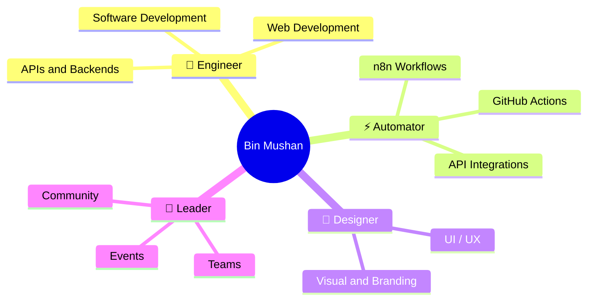

<!-- ───────────────────────────  HERO  ─────────────────────────── -->

<a href="https://github.com/binmushan">
  
</a>

<div align="center">

<a href="https://git.io/typing-svg">
  
</a>

<br/>


&nbsp;

&nbsp;

&nbsp;


<br/><br/>

<a href="https://www.linkedin.com/in/binmushan" target="_blank">
  
</a>

</div>

<br/>

<!-- ───────────────────────────  ABOUT  ─────────────────────────── -->

## &nbsp;<picture><source media="(prefers-color-scheme: dark)" srcset="https://raw.githubusercontent.com/Tarikul-Islam-Anik/Animated-Fluent-Emojis/master/Emojis/Smilies/Waving%20Hand.png" /></picture> &nbsp; About Me

<table>
<tr>
<td valign="top" width="62%">

I am a **BSc ICT undergraduate** working at the intersection of **software development, web, design, and automation** — I write code, shape the experience around it, and connect the dots with workflows that let products ship faster.

Alongside technical work, I take on **team leadership** roles and contribute to **organizing events** in academic and community settings. I believe strong outcomes come from people who can **build, lead, automate, and communicate**.

I use this profile to **practice consistently, learn publicly, and document growth** — across software, web, design, and automation.

```yaml
name:        Bin Mushan
education:   BSc (Hons) ICT — South Eastern University of Sri Lanka
focus:       Software Dev · Web · UI/UX · Automation · Team Leadership
learning:    JavaFX · Supabase · API Integration · n8n Workflows
toolkit:     code · design · automate · ship
fun_fact:    "I ship code, design experiences, and automate the boring parts."
```

</td>
<td valign="top" width="38%">


</td>
</tr>
</table>

<br/>

<!-- ───────────────────────────  CURRENTLY (signature touch)  ─────────────────────────── -->

## &nbsp; &nbsp; Currently

<table width="100%">
<tr>
<td align="center" width="25%">

#### 🎯
<sub><b>Building</b></sub>
<br/>
<sub>Software, web apps</sub>
<br/>
<sub>& automation flows</sub>

</td>
<td align="center" width="25%">

#### ⚡
<sub><b>Automating</b></sub>
<br/>
<sub>Workflows with</sub>
<br/>
<sub>n8n &amp; GitHub Actions</sub>

</td>
<td align="center" width="25%">

#### 🌱
<sub><b>Learning</b></sub>
<br/>
<sub>JavaFX · Supabase</sub>
<br/>
<sub>APIs · n8n</sub>

</td>
<td align="center" width="25%">

#### 💭
<sub><b>Mantra</b></sub>
<br/>
<sub><i>"Make it work,</i></sub>
<br/>
<sub><i>beautiful & autonomous."</i></sub>

</td>
</tr>
</table>

<br/>

<!-- ───────────────────────────  THE MAP OF ME (mindmap)  ─────────────────────────── -->

## &nbsp; &nbsp; The Map of Me

> Not a list of buzzwords — a live map of how the pieces of my craft connect.



<br/>

<!-- ───────────────────────────  SKILLS  ─────────────────────────── -->

## &nbsp; &nbsp; Tech Stack

<table width="100%">
<tr>
<td width="50%" valign="top">

<h3 align="center">💻 &nbsp; Engineer</h3>

<p align="center"><sub><b>Web Development</b></sub></p>
<p align="center">
  
</p>

<p align="center"><sub><b>Languages &amp; Data</b></sub></p>
<p align="center">
  
  &nbsp;
  
</p>

<p align="center"><sub><b>Backend &amp; Services</b></sub></p>
<p align="center">
  
</p>

<p align="center"><sub><b>Developer Tools</b></sub></p>
<p align="center">
  
</p>

</td>
<td width="50%" valign="top">

<h3 align="center">🎨 &nbsp; Designer &amp; Lead</h3>

<p align="center"><sub><b>UI &amp; Design</b></sub></p>
<p align="center">
  
</p>

<p align="center"><sub><b>Productivity</b></sub></p>
<p align="center">
  
  &nbsp;
  
</p>

<p align="center"><sub><b>Leadership &amp; Soft Skills</b></sub></p>
<p align="center">
  
  
  <br/>
  
  
</p>

</td>
</tr>
</table>

<!-- Full-width Automation strip -->
<div align="center">

<br/>

<h3>⚡ &nbsp; Automation &amp; Workflows</h3>

<sub><i>Connecting tools, APIs, and people — so the repetitive parts run themselves.</i></sub>

<p>
  
</p>

<sub>📚 &nbsp; Currently learning &nbsp;→&nbsp; <b>JavaFX</b> &nbsp;·&nbsp; <b>Supabase</b> &nbsp;·&nbsp; <b>API Integration</b> &nbsp;·&nbsp; <b>n8n Workflows</b></sub>

</div>

<br/>

<!-- ───────────────────────────  GITHUB STATS (theme-adaptive)  ─────────────────────────── -->

## &nbsp; &nbsp; GitHub Stats

<div align="center">

<a href="https://github.com/binmushan">
  <picture>
    <source media="(prefers-color-scheme: dark)" srcset="https://github-readme-stats.vercel.app/api?username=binmushan&show_icons=true&include_all_commits=true&count_private=true&hide_border=true&title_color=8B5CF6&icon_color=06B6D4&text_color=CBD5E1&bg_color=00000000" />
    
  </picture>
</a>
<a href="https://github.com/binmushan">
  <picture>
    <source media="(prefers-color-scheme: dark)" srcset="https://github-readme-stats.vercel.app/api/top-langs/?username=binmushan&layout=compact&langs_count=8&hide_border=true&title_color=8B5CF6&text_color=CBD5E1&bg_color=00000000" />
    
  </picture>
</a>

<br/>

<a href="https://github.com/binmushan">
  <picture>
    <source media="(prefers-color-scheme: dark)" srcset="https://github-readme-streak-stats.herokuapp.com?user=binmushan&hide_border=true&background=00000000&ring=8B5CF6&fire=06B6D4&currStreakLabel=8B5CF6&sideLabels=CBD5E1&dates=94A3B8&currStreakNum=F1F5F9&sideNums=E2E8F0" />
    
  </picture>
</a>

<br/><br/>

<a href="https://github.com/binmushan">
  <picture>
    <source media="(prefers-color-scheme: dark)" srcset="https://github-readme-activity-graph.vercel.app/graph?username=binmushan&bg_color=00000000&color=CBD5E1&line=8B5CF6&point=06B6D4&area=true&hide_border=true" />
    
  </picture>
</a>

</div>

<br/>

<!-- ───────────────────────────  LEADERSHIP  ─────────────────────────── -->

## &nbsp; &nbsp; Leadership &amp; Community

> Beyond coursework and coding, I have built practical experience in **people-focused** roles.

<table width="100%">
<tr>
<td width="50%" valign="top">

#### &nbsp;🧭 &nbsp; Team Leadership
Led project teams in academic and community settings — handling **task coordination**, **milestone tracking**, and **team alignment**.

</td>
<td width="50%" valign="top">

#### &nbsp;🎪 &nbsp; Event Organizing
Planned and executed tech and creative events **end-to-end** — covering logistics, communication, and on-day coordination.

</td>
</tr>
<tr>
<td width="50%" valign="top">

#### &nbsp;🤝 &nbsp; Volunteering
Actively participate in and help organize **volunteering events, workshops, and competitions** that contribute to community and peer growth.

</td>
<td width="50%" valign="top">

#### &nbsp;💬 &nbsp; People-First Approach
Strong collaboration and clear communication matter **just as much** as technical ability — that mindset shapes how I work and lead.

</td>
</tr>
</table>

<br/>

<!-- ───────────────────────────  REPO MAP  ─────────────────────────── -->

## &nbsp; &nbsp; Projects &amp; Repository Map

```bash
📦 binmushan/
 ┣━ 🎓  university-projects/    # ICT coursework & academic builds
 ┣━ 💾  software-builds/        # Standalone software & desktop apps (JavaFX, Java)
 ┣━ 🌐  web-development/        # Practice builds & frontend experiments
 ┣━ 🎨  design-experiments/     # Creative work, UI prototypes, brand pieces
 ┣━ 🔌  api-integrations/       # Backend explorations & integrations
 ┣━ ⚡  automation-flows/       # n8n workflows, scripts & GitHub Actions
 ┗━ 🚀  learning-challenges/    # Independent challenges & growth projects
```

<br/>

<!-- ───────────────────────────  DEV QUOTE (theme-adaptive)  ─────────────────────────── -->

<div align="center">

<picture>
  <source media="(prefers-color-scheme: dark)" srcset="https://quotes-github-readme.vercel.app/api?type=horizontal&theme=tokyonight" />
  
</picture>

</div>

<br/>

<!-- ───────────────────────────  OPEN TO  ─────────────────────────── -->

## &nbsp; &nbsp; Open to Opportunities

<table>
<thead>
<tr>
<th align="left">Area</th>
<th align="left">Details</th>
</tr>
</thead>
<tbody>
<tr>
<td>💼 &nbsp; <b>Internships</b></td>
<td>Software development, web, UI/UX, automation, and creative tech roles</td>
</tr>
<tr>
<td>🤝 &nbsp; <b>Collaborations</b></td>
<td>Technical or creative team projects, side builds, hackathons</td>
</tr>
<tr>
<td>⚡ &nbsp; <b>Automation Builds</b></td>
<td>n8n workflows, API integrations, GitHub Actions, scripted tooling</td>
</tr>
<tr>
<td>🎯 &nbsp; <b>Leadership &amp; Coordination</b></td>
<td>Team lead, project coordination, and event organizing roles</td>
</tr>
<tr>
<td>🙋 &nbsp; <b>Volunteering</b></td>
<td>Events, workshops, competitions, and community initiatives</td>
</tr>
<tr>
<td>📚 &nbsp; <b>Mentorship</b></td>
<td>Open to both learning from others and supporting peers</td>
</tr>
</tbody>
</table>

<div align="center">
  <br/>
  <sub>If you think there is a good fit — for work, a project, an event, or a conversation —</sub>
  <br/><br/>
  <a href="https://www.linkedin.com/in/binmushan" target="_blank">
    
  </a>
</div>

<br/>

<!-- ───────────────────────────  FOOTER  ─────────────────────────── -->

<div align="center">


<sub><strong>Bin Mushan</strong> &nbsp;·&nbsp; BSc (Hons) ICT &nbsp;·&nbsp; South Eastern University of Sri Lanka</sub>

</div>
